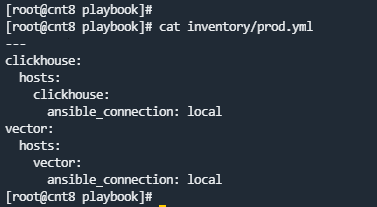
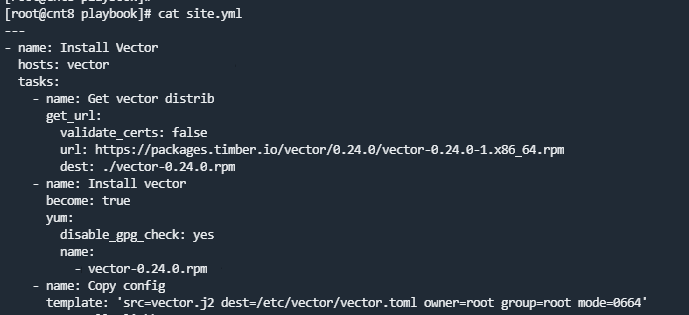
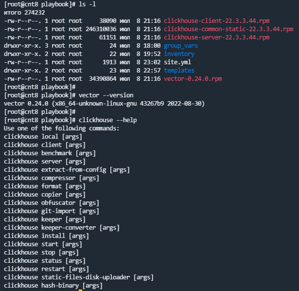
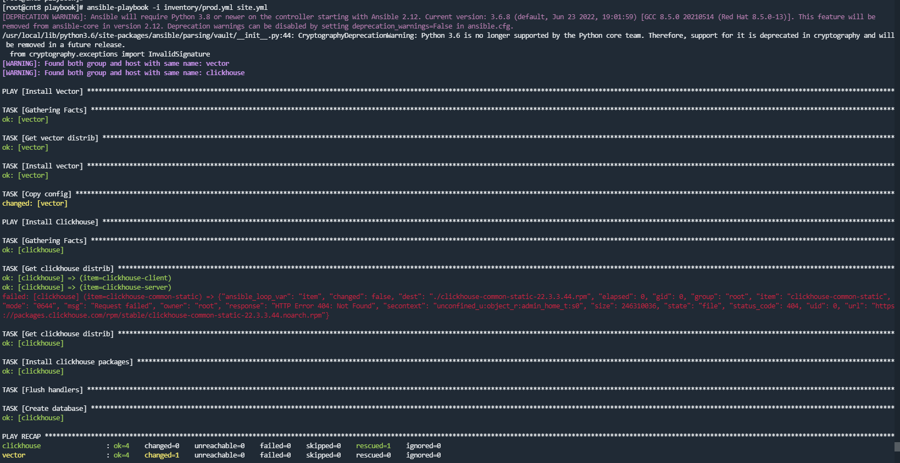
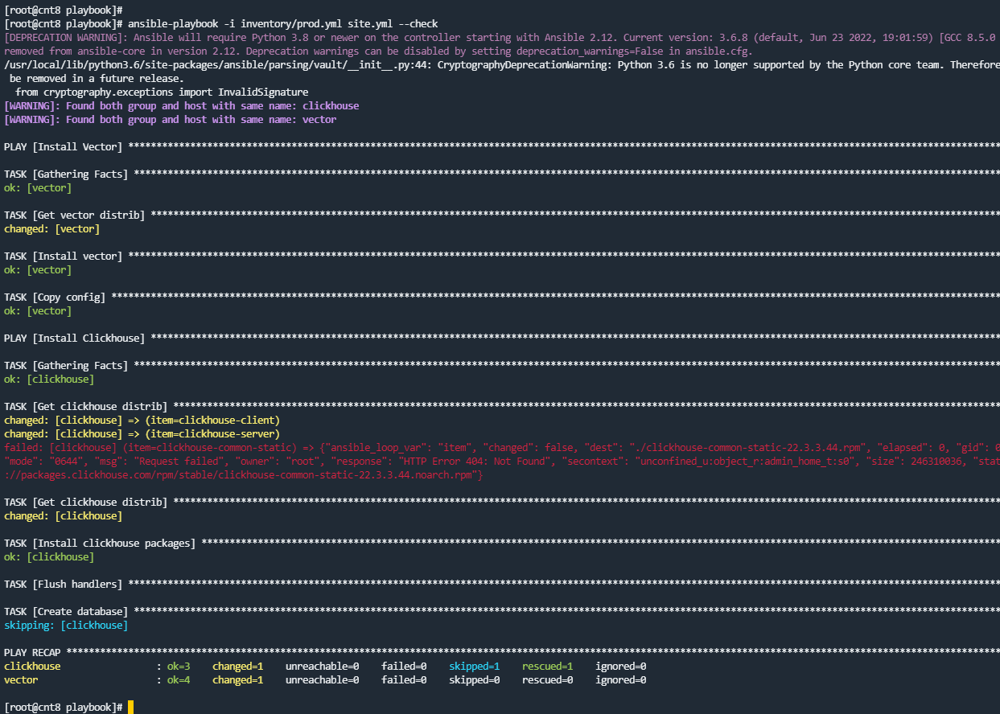
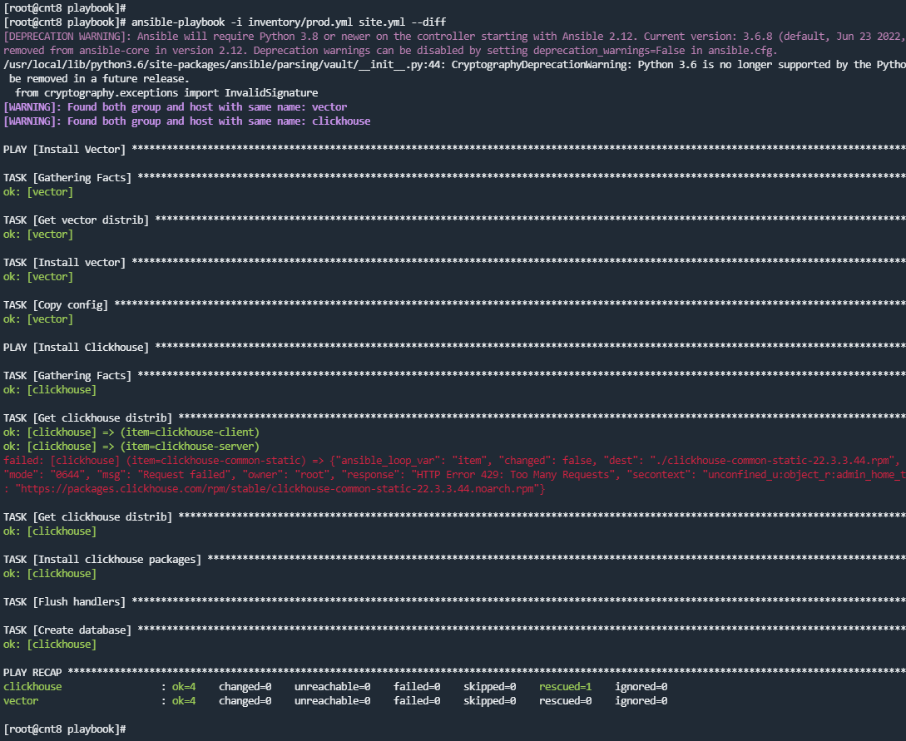
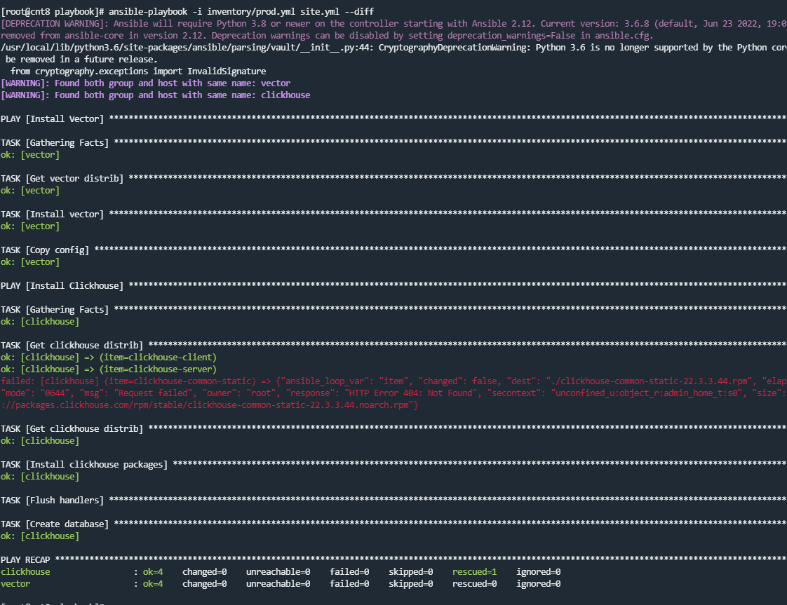
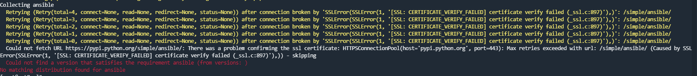
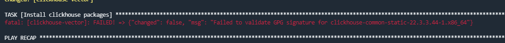

## 08.02 Работа с Playbook

# 1.

# 2.

# 3.
Использовал get_url для скачивания и template для замены конфига (конфиг взял из инета).

# 4. 
Скачивает и устанавливает

 

# 5.

# 6.

# 7.

# 8. 
Идемпотентен.

# 9.
Playbook скачивает и устанавливает Vector и Clickhouse. Также запускается сервис Clickhouse и создается БД.

Пока пришлось использовать `validate_certs` так как были пробемы со скачиванием

и `disable_gpg_check` проблемы с установкой

Как пофиксить пока не разобрался (гуглил достаточно долго). Накостылял так, но в целом playbook отработал :)

# 10. 
https://github.com/ksaohub/devops-netology/tree/main/ansible/ansible8.2/playbook