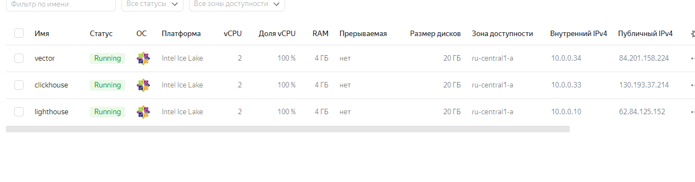
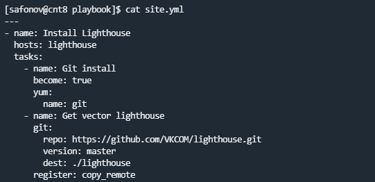
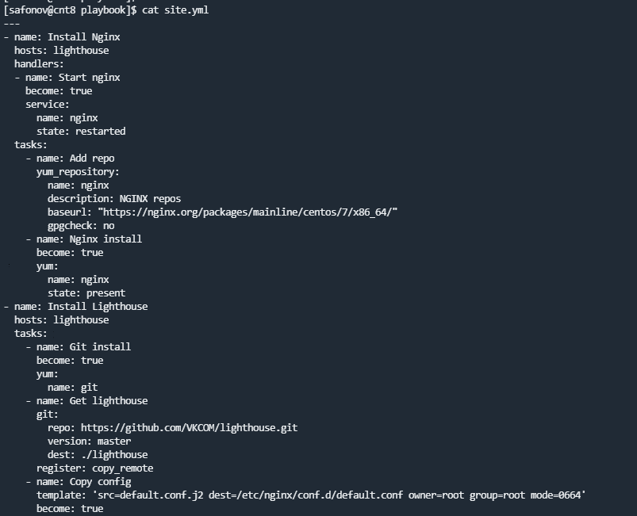
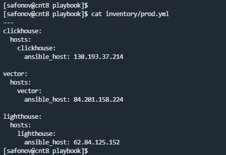
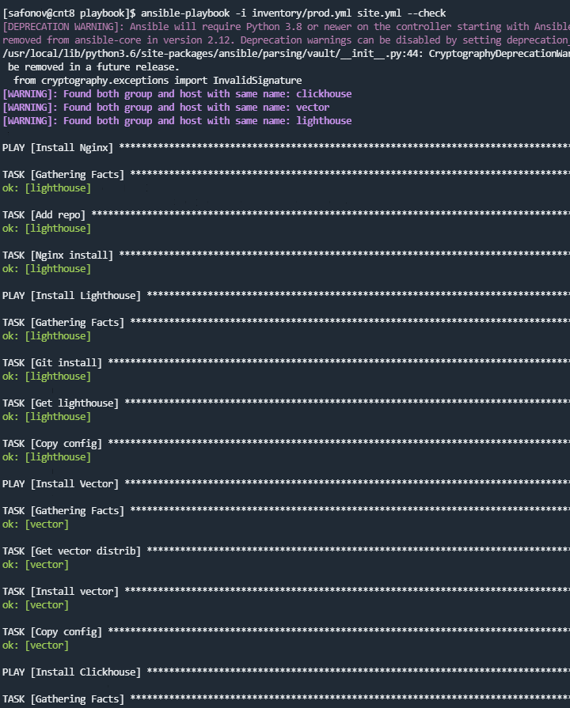
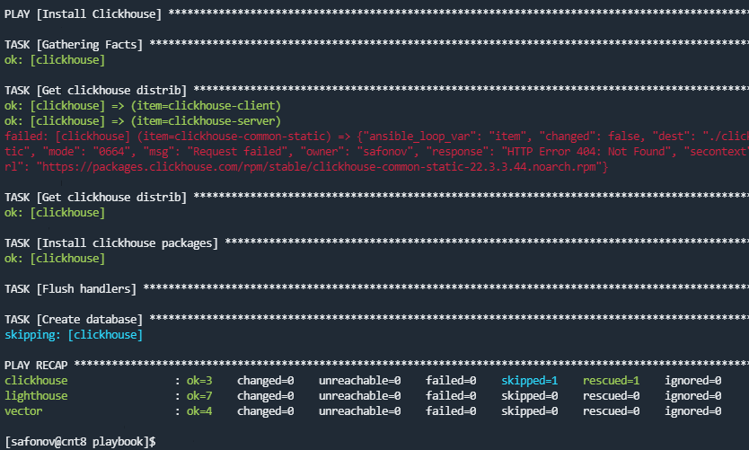
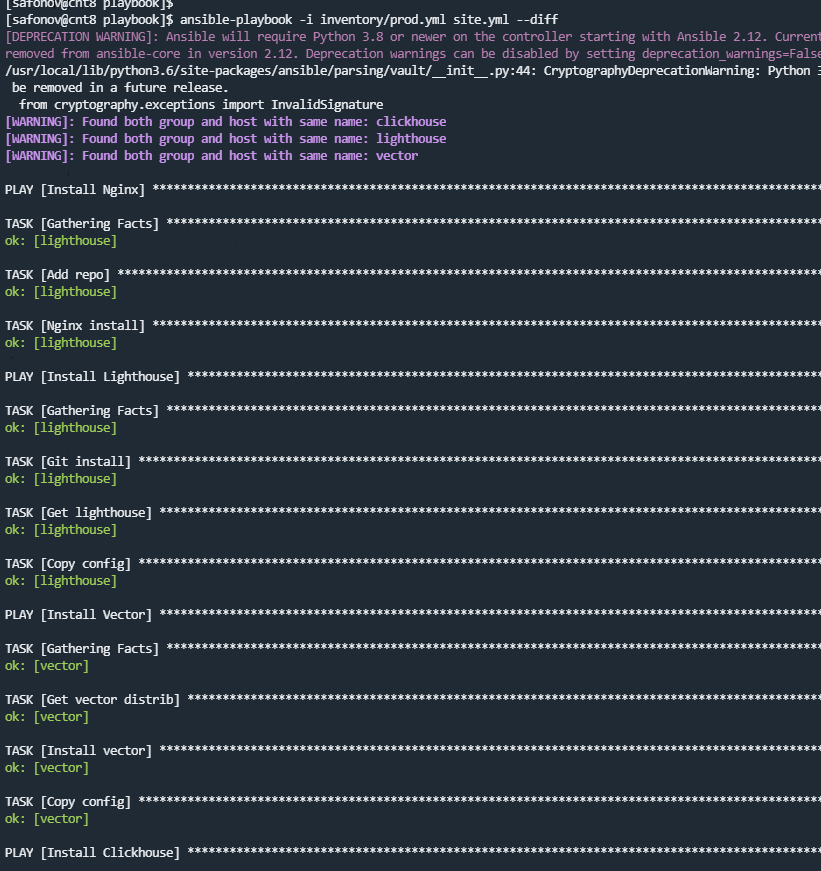
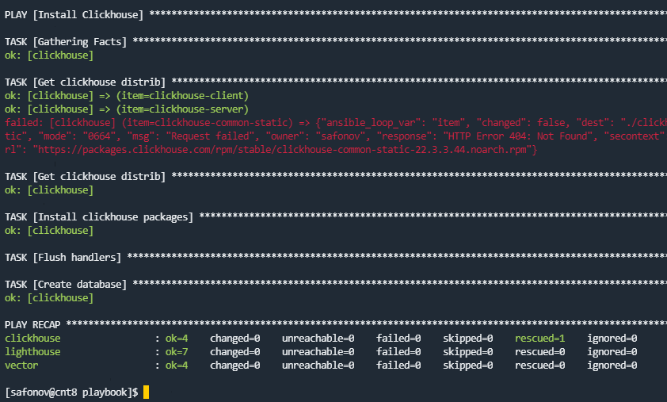

## 08.03 Использование Yandex Cloud

### Хосты:

### 1.

### 2.
Использовал get_url для скачивания пакетов и yum для установки на хосте, модуль git для скачивания репозитория с lighthouse, template для замены конфигов. 

### 3.

### 4.

### 5.
Ошибки поправлены

### 6.

### 7.

### 8.
Результат тот же. Playbook идемпотентен.

### 9.
Playbook скачивает и устанавливает Vector, Clickhouse и Lighthouse на разных хостах в Яндекс облаке. Запускается сервис Clickhouse и создается БД. Так же устанавливается и настаивается веб сервер nginx на хосте с lighthouse для доступа в веб интерфейс.  

### 10.