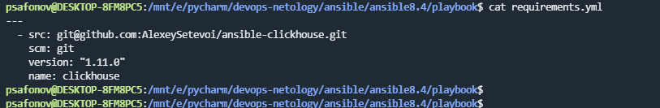
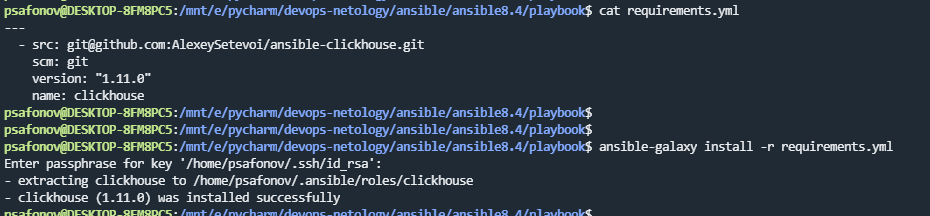
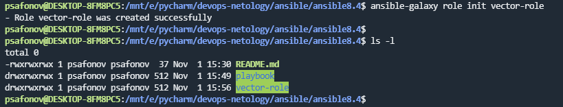

## 8.4 Работа с Roles

# 1.

# 2.

# 3.

# 4-5. 
Переменные и шаблоны конфигов перенесены, ссылка не репозиторий: https://github.com/ksaohub/vector-role 

# 6.
Подготовлены README.md для ролей.

# 7. 
Сделано, ссылка на репозиторий: https://github.com/ksaohub/lighthouse-role
Сделано и для tasks nginx, ссылка на репозиторий с ролью nginx: https://github.com/ksaohub/nginx-role

# 8.
Роли выложены в отдельные репозитории. 

# 9-10.
Playbook переработан на использование roles, ссылка: https://github.com/ksaohub/devops-netology/blob/main/ansible/ansible8.4/playbook/site.yml

# 11. 
Сcылка на репозитории c playbook: https://github.com/ksaohub/devops-netology/blob/main/ansible/ansible8.4/playbook

Ссылка с ролью nginx: https://github.com/ksaohub/nginx-role

Ссылка с ролью lighthouse-role: https://github.com/ksaohub/lighthouse-role

Ссылка с ролью vector-role: https://github.com/ksaohub/vector-role