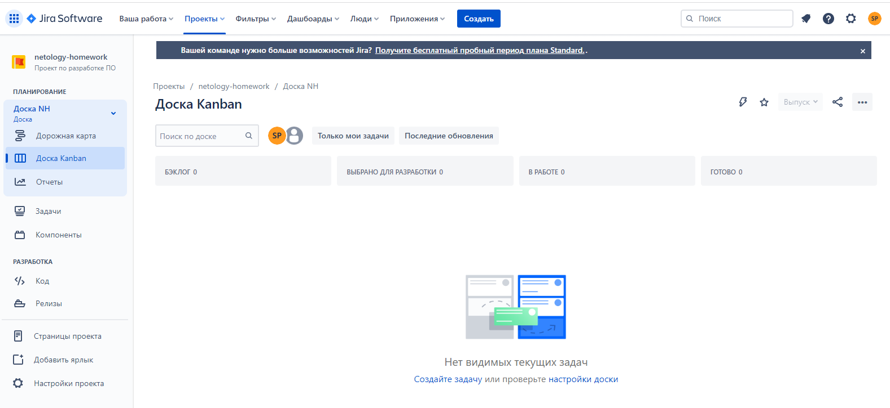
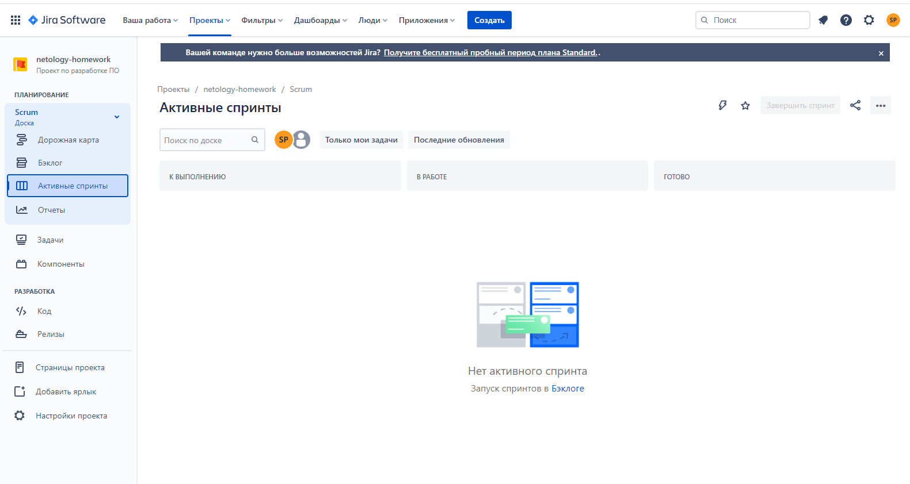
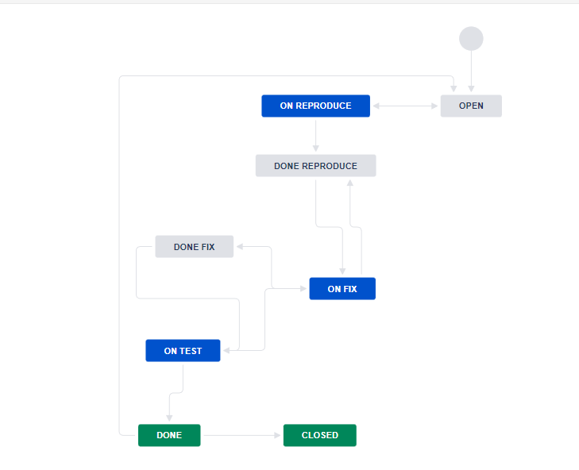
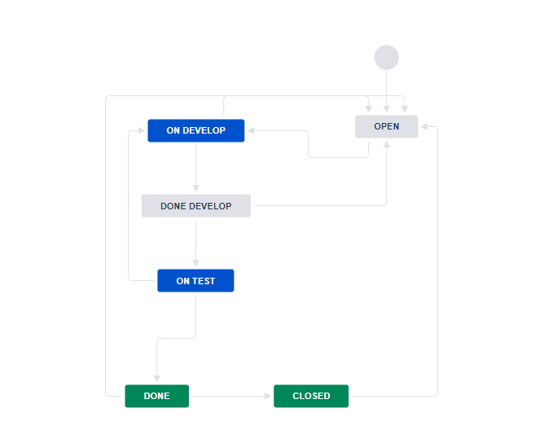
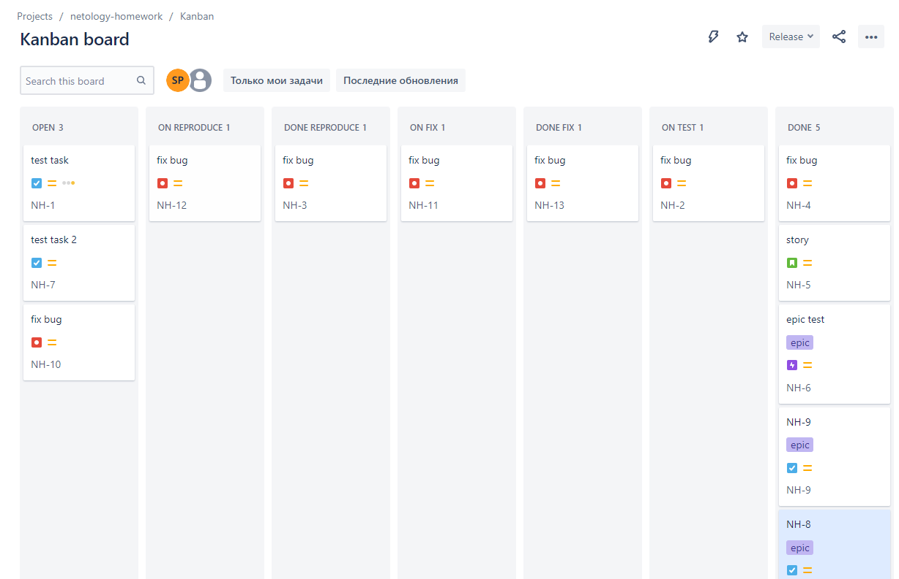
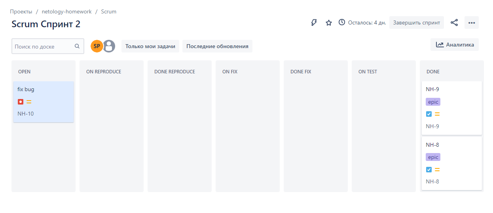

## 09.01 Жизненный цикл ПО

# 1.
Созданы доски kanban и scrum

# 2.
Созданы два workflow:

 - для багов

 - для остальных задач

# 3.

Заведены задачи и проведены по созданным workflow:

 - по доске kanban

 - по доске scrum

# 4. 

Ссылка на workаlow в xml: https://github.com/ksaohub/devops-netology/tree/main/cicd/9.1/workflows

