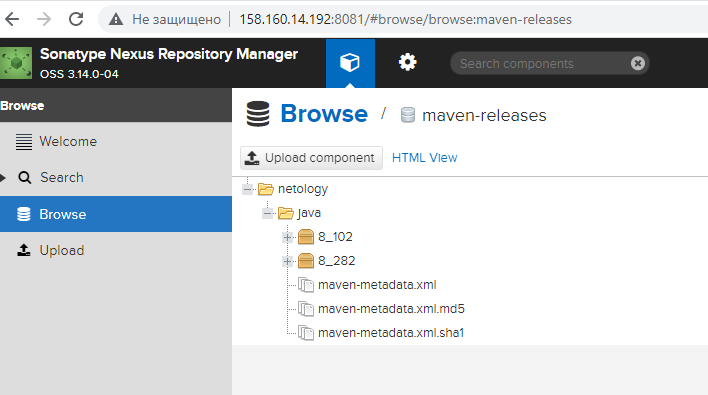

## 9.3 Процессы CI/CD

Подготовка завершена:
- ВМ созданы 

- Playbook отработал,

- Веб-интерфейсы загружаются: 
 
 

### SonarQube

#### 1.

Проект создан: 

#### 2-4.

Пакет sonar-scanner скачан и работает: 

#### 5.

#### 6.

#### 7-9.

Ошибки поправлены: 

### Nexus

#### 1-3.

#### 4.

https://github.com/ksaohub/devops-netology/tree/main/cicd/9.3/maven-metadata.xml

### Maven

#### 1-4.

### Основная часть

#### 1.

#### 2.

#### 3.

#### 4.

https://github.com/ksaohub/devops-netology/tree/main/cicd/9.3/pom.xml