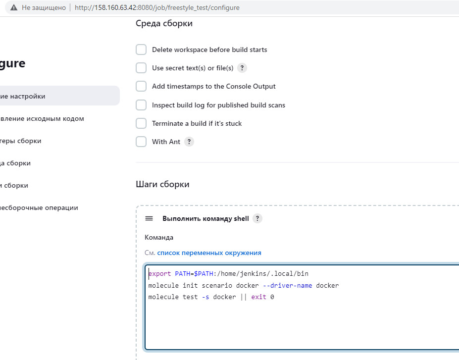
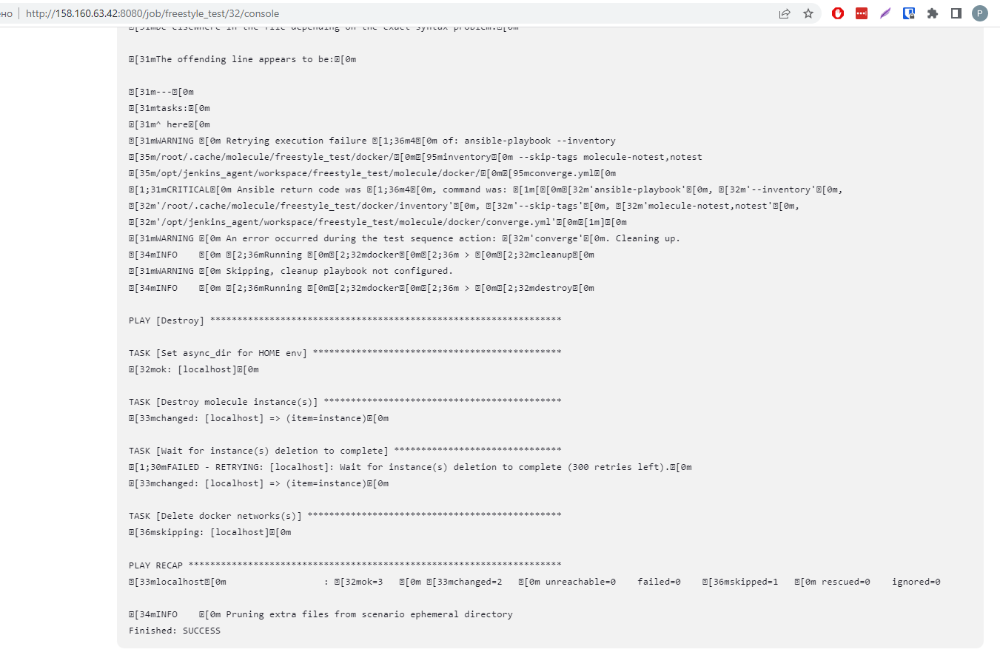
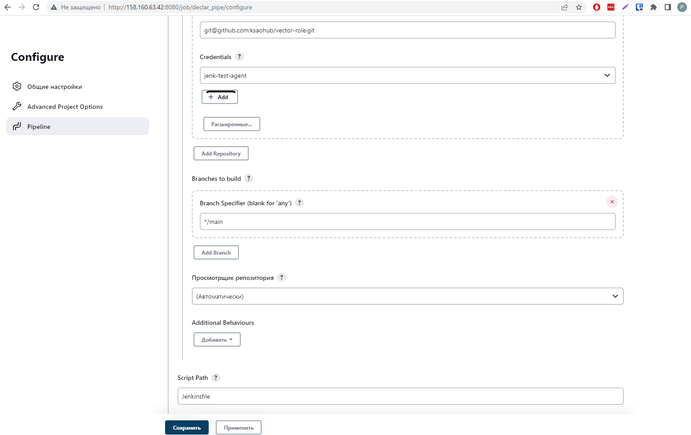
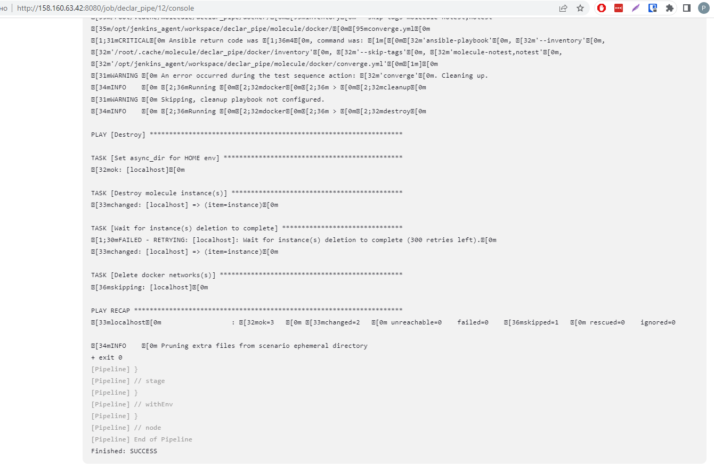
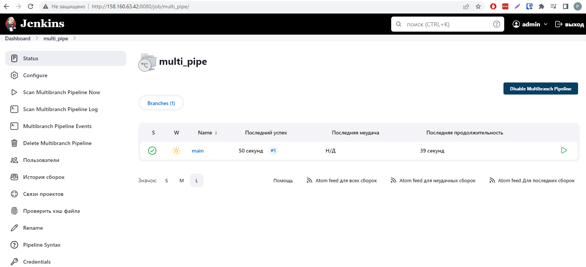
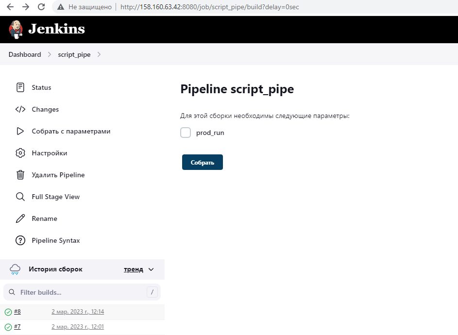
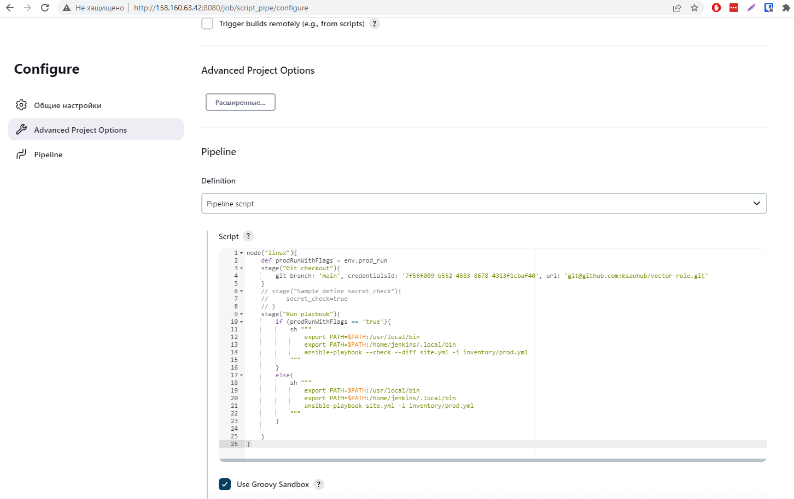

## 09.04 Jenkins

### 1.

Freestyle Job, которая запускает molecule test

Ссылка на вектор роль: https://github.com/ksaohub/vector-role

### 2-3.

Declarative Pipeline Job, которая запускает molecule test

Ссылка на Jenkinsfile: https://github.com/ksaohub/vector-role/blob/main/Jenkinsfile

### 4.

Multibranch Pipeline которая запускает Jenkinsfile из репозитория.

 

### 5-6.

Scripted Pipeline с параметром prod_run, который по дефолту False

### 7-8.

Ссылка на роль: https://github.com/ksaohub/vector-role

Ссылка на Jenkinsfile: https://github.com/ksaohub/vector-role/blob/main/Jenkinsfile

Ссылка на ScriptedJenkinsfile https://github.com/ksaohub/vector-role/blob/main/ScriptedJenkinsfile

