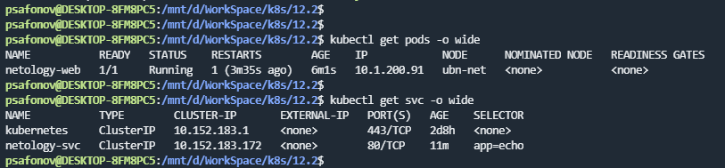
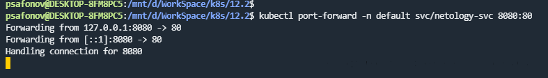
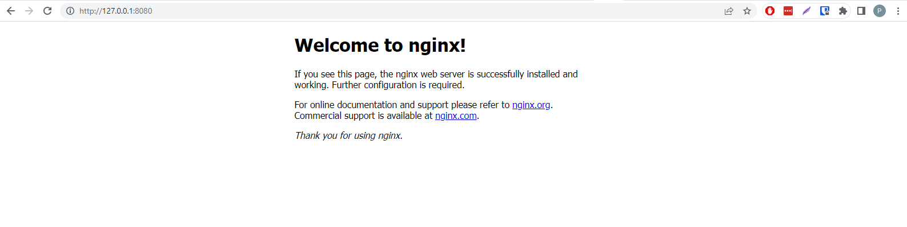
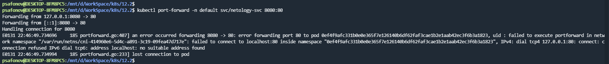

## 12.2 Базовые объекты K8S

### 1.

### 2.

Имадж для создания поды netology-web использовал nginx, т.к. при использовании того, что указан в задании после выполнения port-forward и попытке открыть в браузере или дернуть курлом получал следующую ошибку:

После нескольких часов гугления и танцами с бубном решения так и не нашел, попробавал другой имадж и всё открывается без проблем. Если подскажите в чем проблема, было бы крайне интересно:)  

### 3.

Ссылка на файлы манифестов: https://github.com/ksaohub/devops-netology/tree/main/k8s/12.2/confs