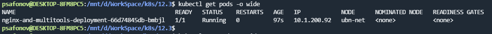
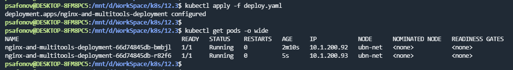
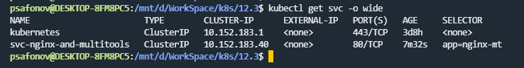
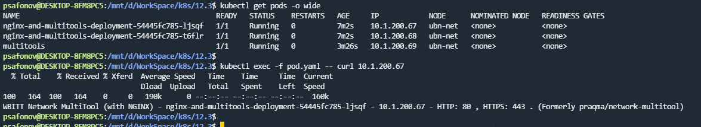
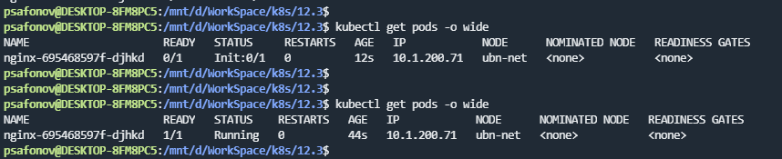
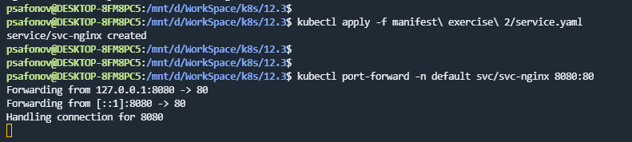
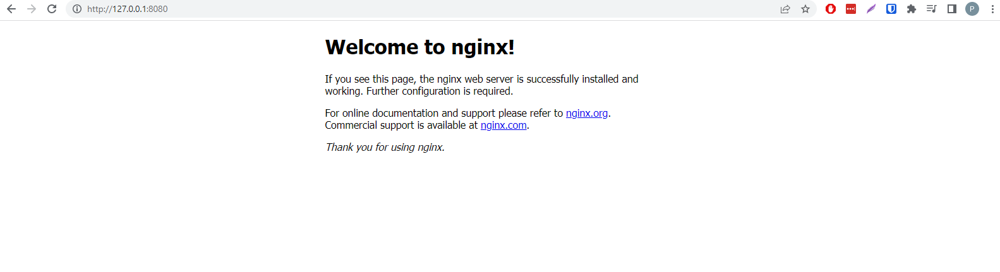

## 12.3 Запуск приложений в K8S

### 1. 

после добавления `replicas: 2`

service:

curl из pod multitools до реплик приложений созданных deployment:

### 2.

### Ссылка на файлы манифестов:

