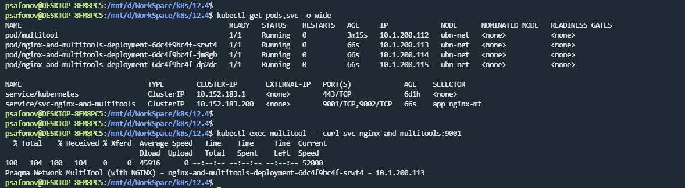
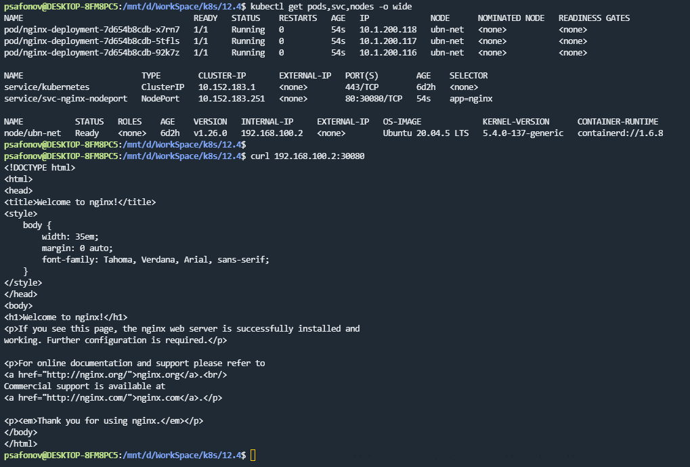

## 12.4 Сетевое взаимодействие в K8S

### 1. 

Доступ с помощью curl по доменному имени сервиса:

Ссылка на манифест:

https://github.com/ksaohub/devops-netology/blob/main/k8s/12.4/manifests/dep-ng-mt-svc.yaml

### 2.

Ссылка на манифест:

https://github.com/ksaohub/devops-netology/blob/main/k8s/12.4/manifests/nginxdep-and-svc-nodePort.yaml