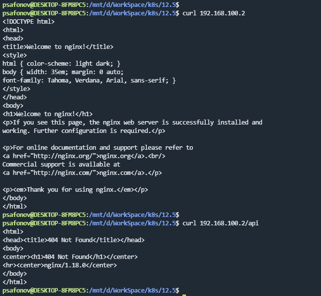
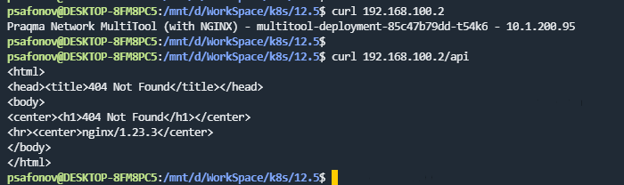

## 12.5 Сетевое взаимодействие в K8S

### 1.

Ссылка на манифесты:

https://github.com/ksaohub/devops-netology/blob/main/k8s/12.5/manifests/

### 2.
Ingress-controller включен

По префиксу /api отвечает nginx мультитулса с 404ой ошибкой. Если поменять местами пути в манифесте ingress, то мультитулс открывается, а nginx по префиксу тоже с 404.

Если подскажите чего не хватает, буду признателен:) Сам пока не разобрался в чем проблема.

Ссылка на манифест: https://github.com/ksaohub/devops-netology/blob/main/k8s/12.5/manifests/ingress.yaml