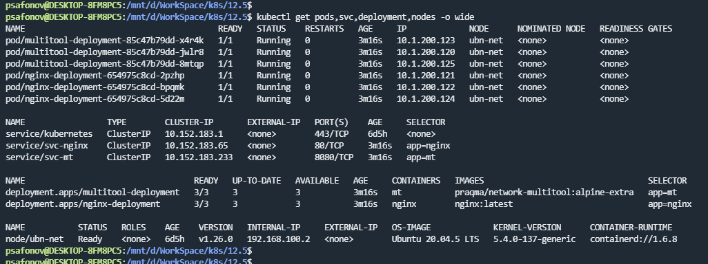
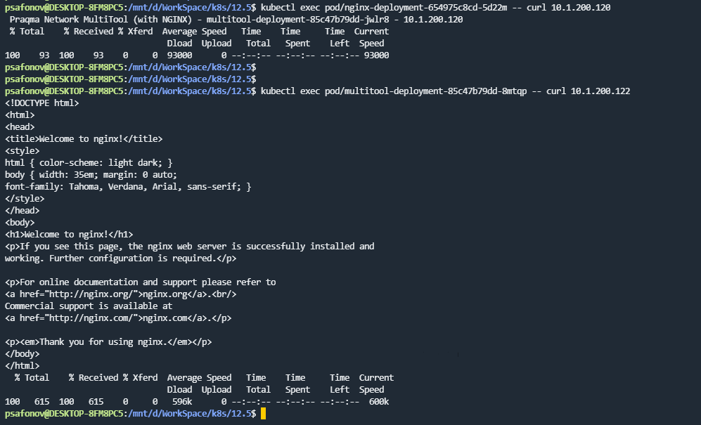
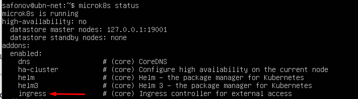
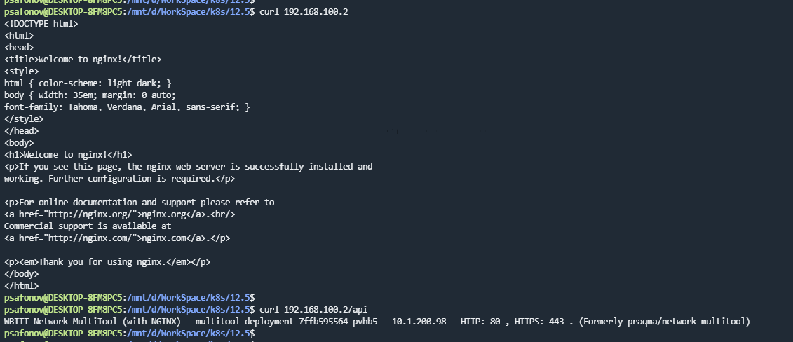

## 12.5 Сетевое взаимодействие в K8S

### 1.

Ссылка на манифесты:

https://github.com/ksaohub/devops-netology/blob/main/k8s/12.5/manifests/

### 2.
Ingress-controller включен

Ссылка на манифест: https://github.com/ksaohub/devops-netology/blob/main/k8s/12.5/manifests/ingress.yaml