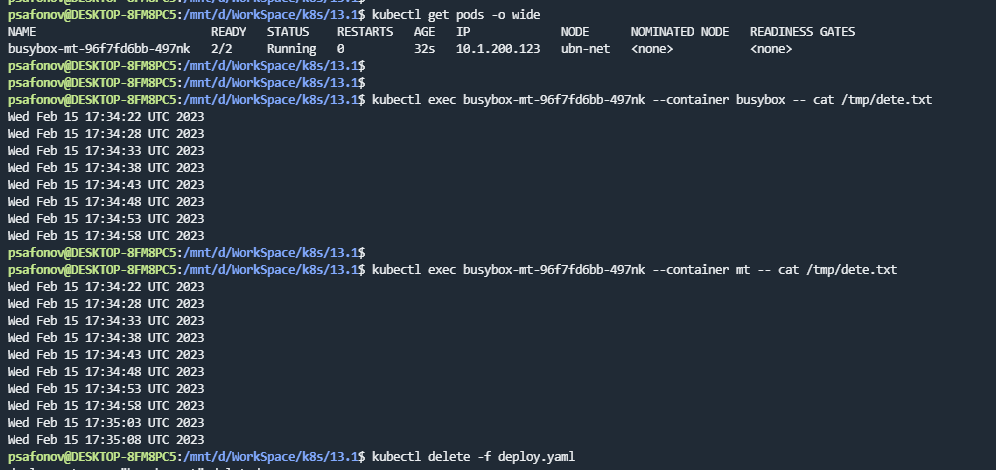
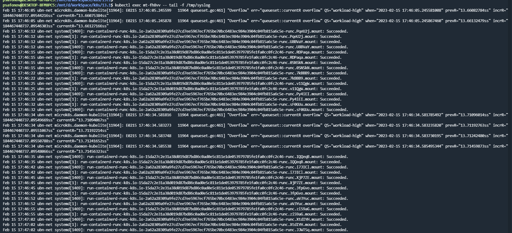
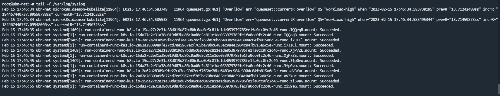

## 13.1 Хранение в K8s

### 1.

Чтение файла контейнером multitool, который обновляет контейнер busybox

https://github.com/ksaohub/devops-netology/blob/main/k8s/13.1/manifests/deployment.yaml

### 2.

Чтение файла `/var/log/syslog` кластера microK8S подом multitool

Содержимое файла `/var/log/syslog` на самом кластере:

https://github.com/ksaohub/devops-netology/blob/main/k8s/13.1/manifests/daemonSet.yaml