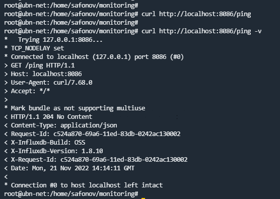
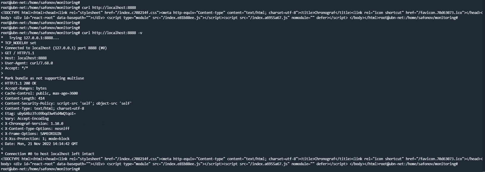
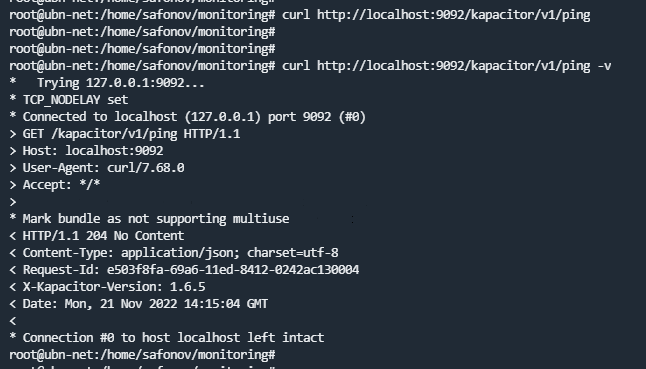
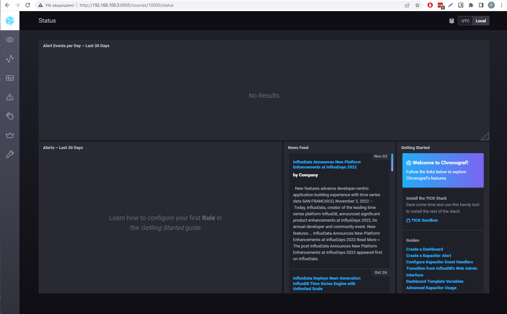
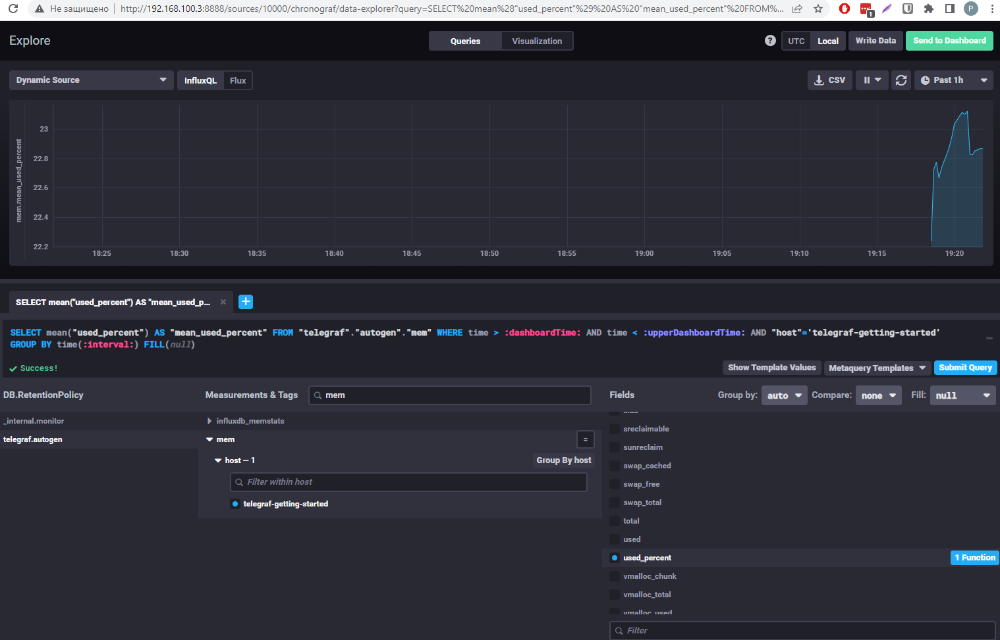
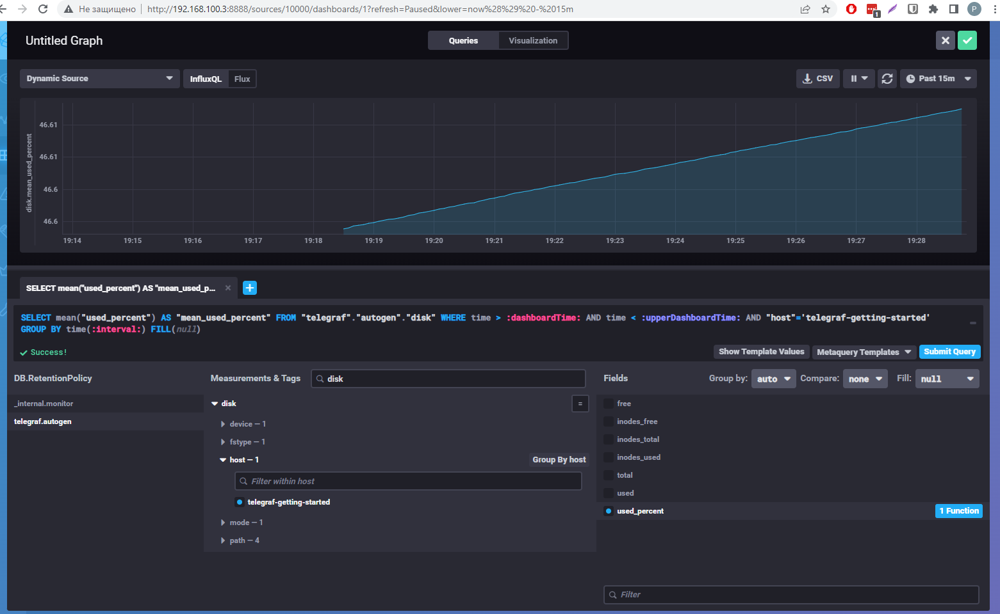
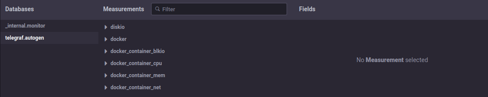

## 10.02. Системы мониторинга

### 1. 

Плюсы Pull-модели:
- Контроль получаемых данных, метрик, т.к. сам настраиваем что и как опрашивать.
- Возможность подключение к агентам по SSL.
- Единая точка конфигурирования, сам сервер, которому надо рассказать, что и откуда забирать.
- Упрощенная отладка получения данных с агентов, т.к. обычным curl запросом можем получить необходимы данные с агента.

Минусы Pull-модели:
- Единая точка конфигурирования, так же является и минусом такой модели, т.к. в случае отвала сети теряются показатели за время её простоя.

Плюсы Push-модели: 
- Упрощение репликации данных в разные системы мониторинга или их резервные копии.
- Гибкая настройка передачи данных с метриками, можно задать и объем данных и частоту отправки.
- Используется UDP, что является менее затратным способом передачи данных.

Минусы Push-модели:
- Передача данных осуществляется в открытом виде, соответственно есть риск утечки данных.

### 2. 

- Prometheus - pull.
- TICK - push.
- Zabbix - использует как push, так и pull, т.е. гибридная система.
- VictoriaMetrics - push.
- Nagios - pull.

### 3.

### 4.

### 5.

