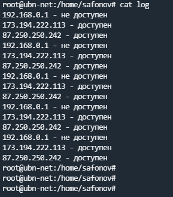

# devops-netology homework
## 4.1. Командная оболочка Bash: Практические навыки"

1. `c=a+b` - потому что указаны символы, а не переменные

    `d=1+2` - потому что указаны переменные без операции сложения

    `e=3` - потому что переменные указаны в конструкции $(())


2. Необходимо добавить условие принудительного завершения. Так же в скрипте пропущена скобка в условии цикла while

    ```bash
    while ((1==1))
    do
      curl https://localhost:4757
    if (($? != 0))
    then
      date >> curl.log
    else break 
    fi
    done
    ```
   
3. ```bash
   #!/bin/env bash
   ips=(192.168.0.1 173.194.222.113 87.250.250.242) #добавим проверяемые IP в массив
   for a in {1..5} #проверять 5 раз
   do
    for i in ${ips[@]} #проверять все IP из заданного массива
    do
     curl $i:80 --connect-timeout 3 #проверяем IP по 80 порту 
     #если статус запроса равен 0, то записываем в log, что IP доступен, если не равен, то недоступен 
     if [ $? == "0" ]
     then 
      echo "$i - доступен" >> log
     else
      echo "$i - не доступен" >> log
     fi
     done
   done
    ```
    

4. ```bash
   #!/bin/env bash
   ips=(192.168.0.1 173.194.222.113 87.250.250.242) #добавим проверяемые IP в массив
   for a in {1..5} #проверяем 5 раз
   do
    for i in ${ips[@]} #проверяем все IP из заданного массива
    do
     curl $i:80 --connect-timeout 5
     if [ $? == "0" ]
     then 
      echo "$i - доступен" >> log
     else
      echo "$i - не доступен" >> error
      exit #прерываем выполнение скрипта
     fi
    done
   done
   ```