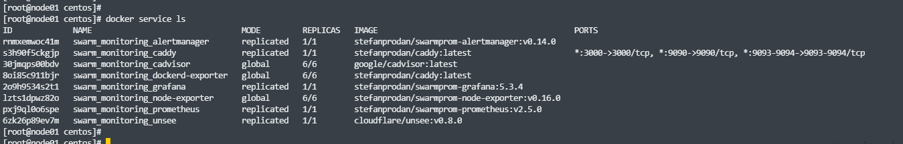

# devops-netology homework

## 5.5. Оркестрация кластером Docker контейнеров на примере Docker Swarm

1. 
   - 
   1. replication - Сервис устанавливается на заданном количестве хостов.
     
   2. global - Сервис устанавливается на всех хостах кластера. При добавлении нового хоста сервисы с параметром global будут установлены автоматически.
   
   - Docker Swarm сам случайным образом выбирает лидера из доступных manager хостов, в случае если текущий лидер был отключен или вышел из строя. При первом запуске, если не ошибаюсь, тоже сам назначает.
   - Overlay Network - это тип сети, которая создает подсети для обмена данными между контейнерами на разных физических хостах.

2. 

3.

4. `docker swarm update --autolock=true` - используется что бы включить ручной доступ к ключам TLS и шифрования Raft logs. Используется для безопасности, т.к. при перезапуске docker эти ключи загружаются на каждую manager ноду. С данным параметром после перезапуска нужно будет разблокировать swarm кластер с помощью сгенерированного ключа. 