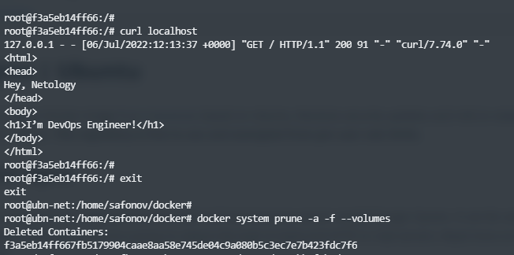
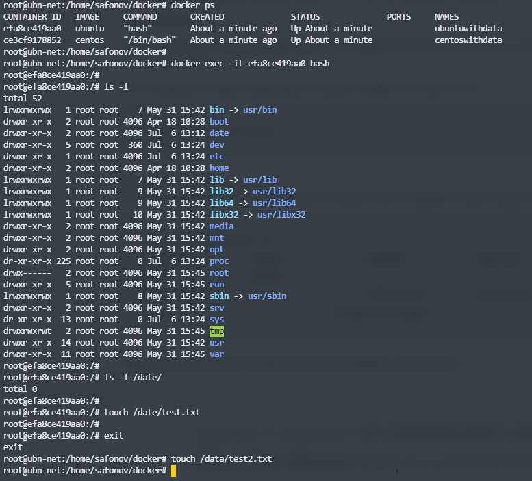
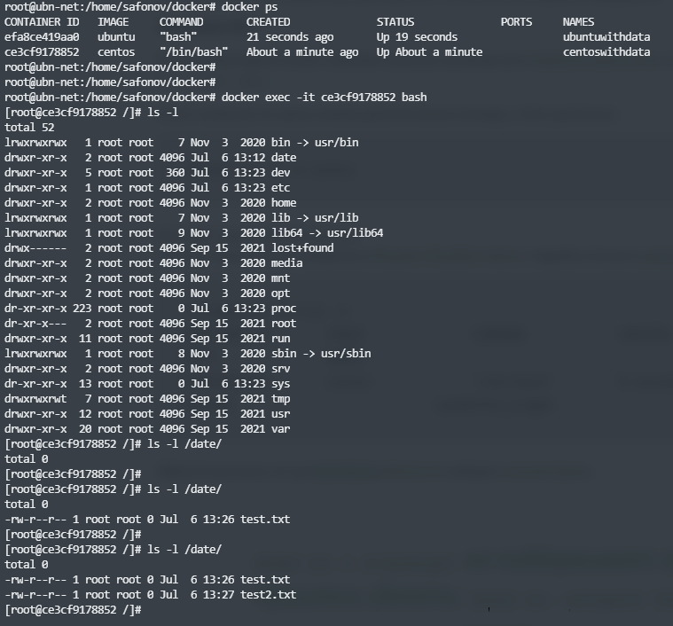

## 5.3. Введение. Экосистема. Архитектура. Жизненный цикл Docker контейнера

1. https://hub.docker.com/repository/docker/ksaohub/myrepofortests
        

2.
   - `Высоконагруженное монолитное java веб-приложение` - виртуальная, а лучше физическая машина.
   - `Nodejs веб-приложение` - в данном случае вполне подойдет докер, что, при необходимости, ускорит деплой веб-приложения на любом сервере.
   - `Мобильное приложение c версиями для Android и iOS` - не уверен, но читал, что мобильные приложения не очень любят разворачивать в докере, хотя при необходимости можно (зависти от самого приложения).  
   - `Шина данных на базе Apache Kafka` - хотя это и не СУБД в чистом вид, но всё же работа с хранением данных, поэтому скажу что докер не подходит.
   - `Elasticsearch кластер для реализации логирования продуктивного веб-приложения - три ноды elasticsearch, два logstash и две ноды kibana` - докер подходит. Хотя видел, что в такой связке logstash ставят отдельно на виртуалку.
   - `Мониторинг-стек на базе Prometheus и Grafana` - однозначно докер, разворачивали на лекции и в домашнем задании. С помощью докера обеспечивается скорость развертки, а так же сразу настроенная сетевая связанность между сервисами стека. 
   - `MongoDB, как основное хранилище данных для java-приложения` - докер не подходит для хранилища данных, поэтому лучше использовать виртуальную или физическую машину
   - `Gitlab сервер для реализации CI/CD процессов и приватный (закрытый) Docker Registry` - считаю, что докер подойдет.

3. 

