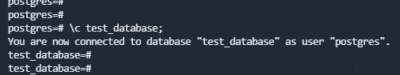
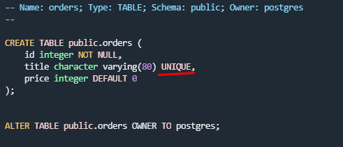

## 6.4. PostgreSQL

# 1.

# 2.

# 3.
`ALTER TABLE orders RENAME to orders_tmp;`

`CREATE TABLE orders (id integer, title varchar(80), price integer) PARTITION BY RANGE(price);`

`CREATE TABLE orders_1 PARTITION OF orders FOR values FROM (499) TO (1000000);`

`CREATE TABLE orders_2 PARTITION of orders FOR values FROM (0) TO (499);`

`INSERT INTO orders (id, title, price) SELECT * FROM orders_tmp;`

# 4.

Для уникальности значения столбца `title` при создании таблицы для столбца `title` добавить `UNIQUE`

