## 6.2. SQL

# 1.

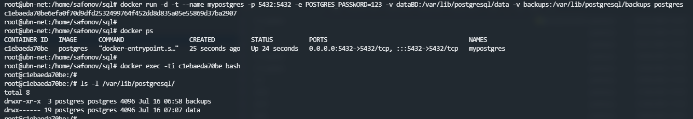

# 2. 
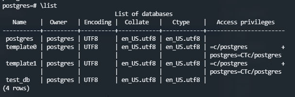 

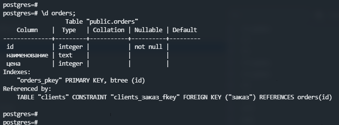 

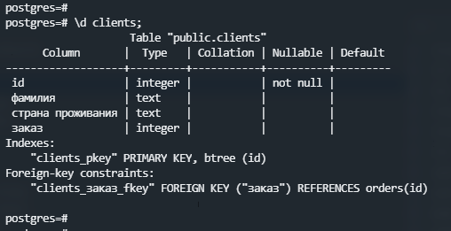

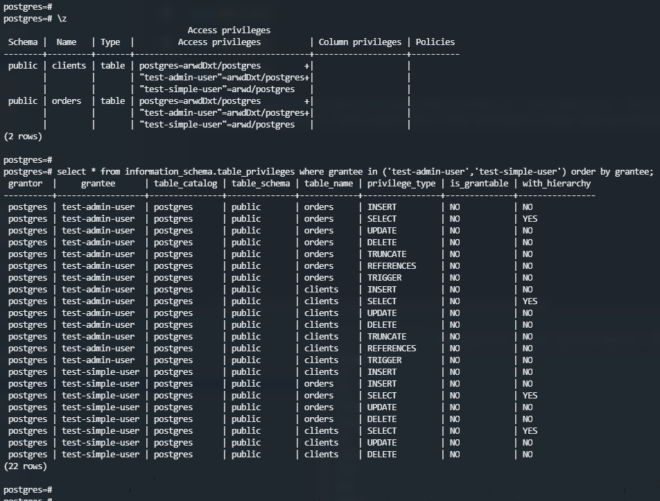

# 3. 
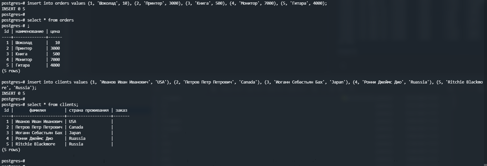

# 4. 
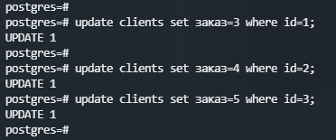

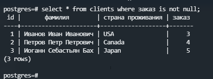

# 5. 
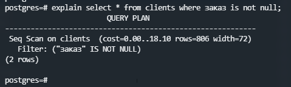

`seq scan` показывает `cost` - нагрузку при выполнении, `rows` - сколько шагов выполнено при запросе, `width` - расчетная средняя ширина (в байтах) строк. 

`filter` - фильтр где `заказ` не пустое значение. 

# 6. 
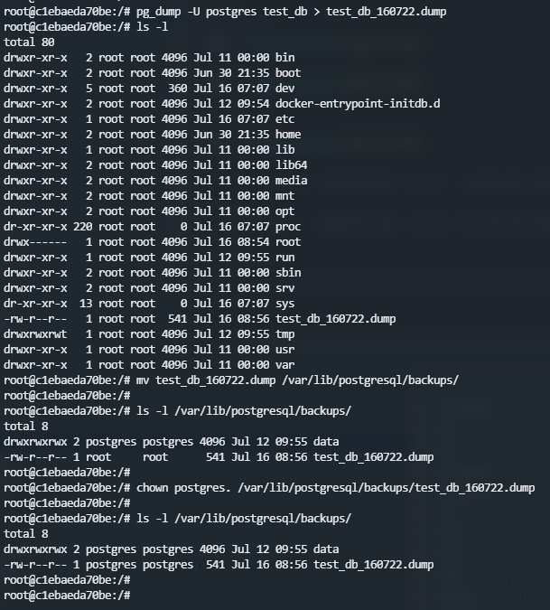

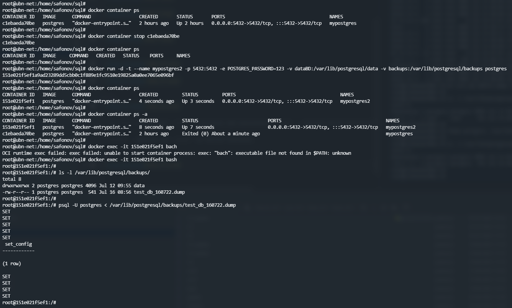