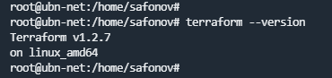
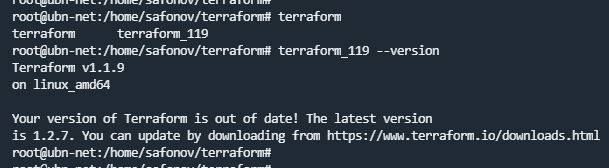

## 7.1. Инфраструктура как код

# 1.
1. 
   - так как на данном этапе наше тех. задание не четкое и ожидается много небольших релизов, то целесообразно использовать изменяемый тип инфраструктуры, потому что при начальном развитии проекта наверняка придется обновлять/доустанавливать пакеты, возможно менять конфиги.
   - думаю нет. Не вижу смысла использовать центральный сервер с самого начала запуска проекта.
   - нет.
   - да, по тем же причинам, что и в первом ответе. 

2. Packer, Terraform, Docker, Ansible.

3. Нет, кажется, что уже используемых инструментов будет достаточно (по крайней мере на запуске проекта).

# 2.

# 3. 

