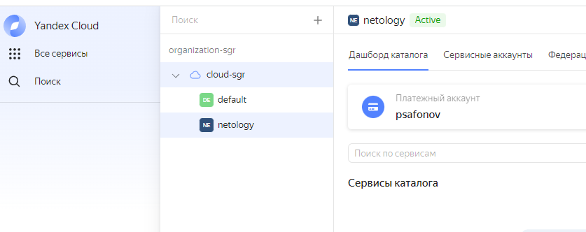
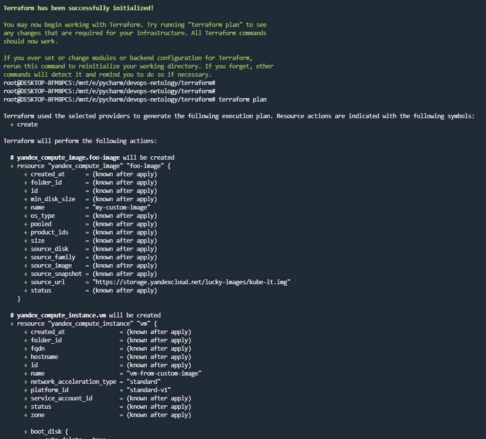
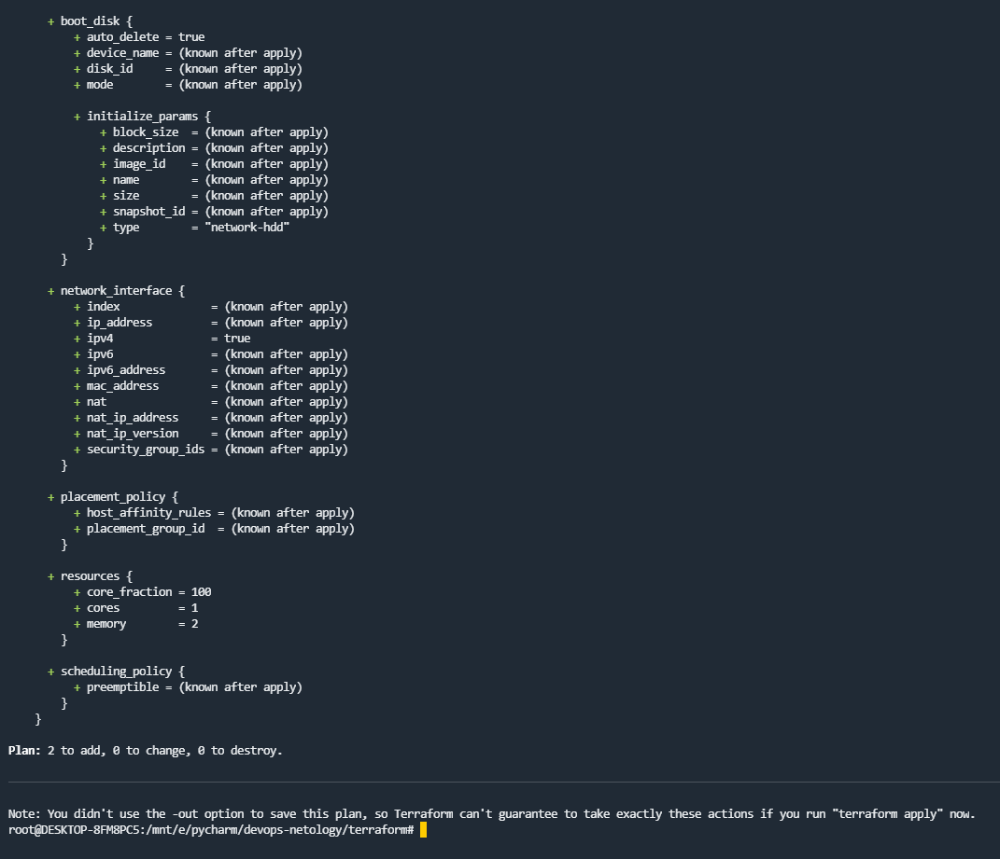

## 7.2. Облачные провайдеры и синтаксис Terraform.

# 1. 
- На AWS не смог зарегистрироваться т.к. требуется подтверждение через телефон, а российские номера не обслуживаются. 

- На Yandex.Cloud зарегистрирован и ознакомлен.

# 2.

- Образ для Yandex.Cloud можно создать с помощью Packer.
- 

