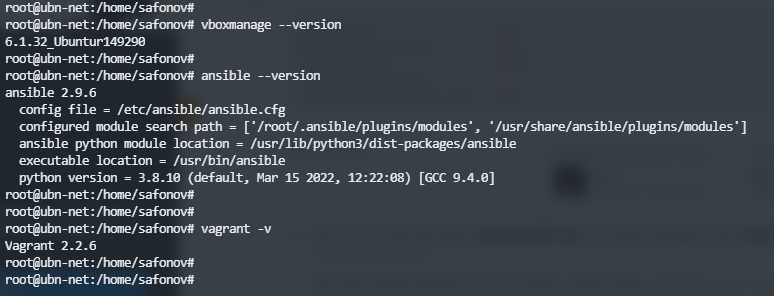

## 5.2. Применение принципов IaaC в работе с виртуальными машинами

1. 
   - Основные приемущества IaaC это ускорение, автоматизация и минимизация ошибок при развертывании инфраструктуры. Что, в свою очередь, напрямую влияет на затраты компании. Инжинер один раз описав инфраструктуру как код, может использовать его многократно на множестве хостах не опасаясь, что на каком-то из них что-то пойдет не так.  
   - Идемпотентность - это гарантия получения того же самого результата при повторном выполнении. 

2. 
   - Приемущество Ansible в том, что для подключения к инфраструктуре используется ssh. На ряду с достаточно простым описанием конфигов это делает Ansible более выгодным решением для управления конфигурациями.   
   - Думаю балее надежным методом является push, так как изменения инициируются управляющим сервером, а не по запросу какого-либо из хостов. Т.е. исключает вероятность попадания не готовой или ошибочной конфигурации на запрашивающем хосте. Например мы написали или исправили конфиг и еще не успели его протестировать, а какой-то хост сделал запрос и начал деплой.

3. 
    

